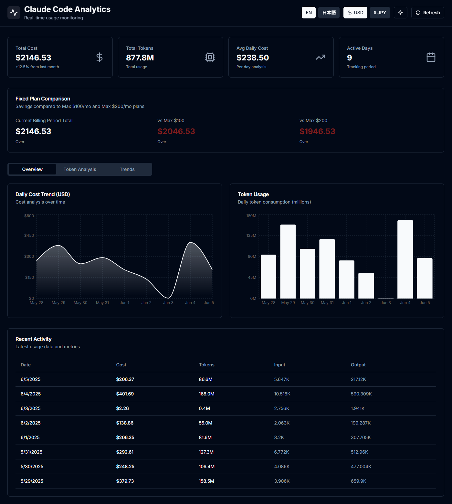

# Claude Code Dashboard

[日本語版](#日本語) | [English](#english)

---

<a name="english"></a>
## English

A beautiful dashboard for tracking Claude Code API usage and costs with USD/JPY currency conversion.



### Features

- 📊 Visual charts showing daily costs and token usage
- 💱 Currency toggle between USD and JPY with real-time exchange rates
- 🌏 Bilingual support (English/Japanese)
- 🌓 Dark/Light theme toggle (Dark by default)
- 📈 Statistics cards showing total costs, tokens, and averages
- 📋 Detailed usage table with token breakdowns
- 💰 Comparison with Max $100/month and $200/month plans
- 🔒 API authentication for production security
- 🐳 Docker support for easy deployment
- 📱 Responsive design

### Prerequisites

- Node.js 18+ installed
- Docker and Docker Compose (for containerized deployment)
- Claude Code CLI installed and configured
- [ccusage](https://www.npmjs.com/package/ccusage) CLI tool (automatically installed via npx)

**About ccusage**: A community-created CLI tool by [ryoppippi](https://github.com/ryoppippi) that extracts and formats Claude Code usage data. This dashboard uses ccusage to fetch your usage statistics and present them in a visual format.

### Security Setup (Optional)

This project is configured for local deployment without API authentication by default. If you need API security for production deployment:

1. Create a `.env.local` file:
```bash
cp .env.example .env.local
```

2. Generate a secure API key:
```bash
openssl rand -base64 32
```

3. Add the API key to `.env.local`:
```
API_KEY=your-generated-key-here
```

4. Uncomment the authentication code in `middleware.ts`

### Quick Start

#### Local Development

1. Clone the repository:
```bash
git clone <repository-url>
cd ClaudeCode_Dashboard
```

2. Install dependencies:
```bash
npm install
```

3. Run the development server:
```bash
npm run dev
```

4. Open [http://localhost:3000](http://localhost:3000) in your browser.

#### Running on Port 3300

To run on port 3300 specifically:
```bash
PORT=3300 npm run dev
```

### Docker Deployment

1. Build and run with Docker Compose:
```bash
./deploy.sh
```

Or manually:
```bash
docker compose up -d --build
```

2. Access the dashboard at [http://localhost:3300](http://localhost:3300)

3. View logs:
```bash
docker compose logs -f
```

4. Stop the dashboard:
```bash
docker compose down
```

### API Usage

API endpoints are accessible without authentication by default:

```bash
curl http://localhost:3000/api/usage
```

If authentication is enabled, use:
```bash
curl -H "x-api-key: your-api-key" http://localhost:3000/api/usage
```

### Development

- `npm run dev` - Start development server
- `npm run build` - Build for production
- `npm start` - Start production server
- `npm run lint` - Run linter

### Environment Variables

- `API_KEY` - API key for securing endpoints (optional - only needed if authentication is enabled)
- `NODE_ENV` - Environment (development/production)

### Troubleshooting

#### Exchange Rate Issues

The exchange rate API uses a free public service. If an error occurs, the last successfully fetched rate will be used. When JPY is selected, you can also manually edit the exchange rate by clicking the edit icon next to the rate display.

### Important Notice

⚠️ **About This Dashboard**: This tool is designed for Max plan subscribers to visualize what their usage would cost under API pricing. Please understand:

- **You are NOT being charged these amounts** - Max plans have fixed monthly pricing
- Displayed values show hypothetical API costs for comparison purposes only
- This helps Max users understand their usage value and compare with API pricing models
- Actual API pricing may vary based on current rates and volume discounts

**This is a reference tool for Max plan users, not a billing statement.**

### Contributing

This repository is a personal project and does not accept pull requests.

### Authors & Contributors

- **m-sigepon** - Project creator
- **Claude Code** - Code development & implementation

This dashboard was developed using Claude Code.

**Disclaimer:** This is an unofficial, community-created project and is not affiliated with, endorsed by, or sponsored by Anthropic PBC. Claude and Claude Code are trademarks of Anthropic PBC.

### License

MIT License - see [LICENSE](LICENSE) file for details.

---

<a name="日本語"></a>
## 日本語

Claude Code APIの使用状況とコストをUSD/JPY通貨変換付きで追跡する美しいダッシュボード。


### 機能

- 📊 日別コストとトークン使用量を表示するビジュアルチャート
- 💱 リアルタイム為替レートでUSDとJPYを切り替え
- 🌏 バイリンガル対応（英語/日本語）
- 🌓 ダーク/ライトテーマ切り替え（デフォルトはダーク）
- 📈 総コスト、トークン、平均値を表示する統計カード
- 📋 トークン内訳付きの詳細な使用状況テーブル
- 💰 Max $100/月および$200/月プランとの比較
- 🔒 本番環境セキュリティのためのAPI認証
- 🐳 簡単なデプロイのためのDockerサポート
- 📱 レスポンシブデザイン

### 前提条件

- Node.js 18以上がインストール済み
- Docker と Docker Compose（コンテナ化デプロイ用）
- Claude Code CLIがインストール・設定済み
- [ccusage](https://www.npmjs.com/package/ccusage) CLIツール（npx経由で自動インストール）

**ccusage について**: [ryoppippi](https://github.com/ryoppippi) によって作成されたコミュニティ製の CLI ツールで、Claude Code の使用データを抽出・フォーマットします。このダッシュボードは ccusage を使用して使用統計を取得し、視覚的な形式で表示します。

### セキュリティ設定（オプション）

このプロジェクトはデフォルトでローカルデプロイメント用にAPI認証なしで設定されています。本番デプロイメントでAPIセキュリティが必要な場合：

1. `.env.local`ファイルを作成:
```bash
cp .env.example .env.local
```

2. セキュアなAPIキーを生成:
```bash
openssl rand -base64 32
```

3. APIキーを`.env.local`に追加:
```
API_KEY=生成したキー
```

4. `middleware.ts`内の認証コードのコメントアウトを解除

### クイックスタート

#### ローカル開発

1. リポジトリをクローン:
```bash
git clone <リポジトリURL>
cd ClaudeCode_Dashboard
```

2. 依存関係をインストール:
```bash
npm install
```

3. 開発サーバーを起動:
```bash
npm run dev
```

4. ブラウザで [http://localhost:3000](http://localhost:3000) を開く。

#### ポート3300で実行

ポート3300で実行する場合:
```bash
PORT=3300 npm run dev
```

### Dockerデプロイ

1. Docker Composeでビルド・実行:
```bash
./deploy.sh
```

または手動で:
```bash
docker compose up -d --build
```

2. [http://localhost:3300](http://localhost:3300) でダッシュボードにアクセス

3. ログを表示:
```bash
docker compose logs -f
```

4. ダッシュボードを停止:
```bash
docker compose down
```

### API使用方法

デフォルトでは認証なしでAPIエンドポイントにアクセスできます：

```bash
curl http://localhost:3000/api/usage
```

認証が有効な場合：
```bash
curl -H "x-api-key: your-api-key" http://localhost:3000/api/usage
```

### 開発

- `npm run dev` - 開発サーバーを起動
- `npm run build` - 本番用にビルド
- `npm start` - 本番サーバーを起動
- `npm run lint` - リンターを実行

### 環境変数

- `API_KEY` - エンドポイント保護用のAPIキー（オプション - 認証が有効な場合のみ必要）
- `NODE_ENV` - 環境（development/production）

### ライセンス

MITライセンス - 詳細は[LICENSE](LICENSE)ファイルを参照してください。

### トラブルシューティング

#### ポート3300でアクセスできない場合

1. 既存のプロセスを確認:
```bash
lsof -i :3300
```

2. 既存のコンテナを停止:
```bash
docker compose down
```

3. 開発サーバーを3300番ポートで起動:
```bash
PORT=3300 npm run dev
```

#### Dockerでエラーが発生する場合

1. Dockerのログを確認:
```bash
docker compose logs -f
```

2. コンテナを再ビルド:
```bash
docker compose down
docker compose up -d --build
```

#### 為替レートが取得できない場合

為替レートAPIは無料の公開APIを使用しています。エラーが発生した場合は、最後に取得した有効なレートが使用されます。また、JPY選択時は為替レートを手動で編集することも可能です。

### ご利用にあたっての注意事項

⚠️ **このダッシュボードについて**: 本ツールはMaxプラン利用者が「もしAPI従量課金だったら」を確認するための参考ツールです：

- **表示金額は実際に請求されません** - Maxプランは月額固定料金です
- 表示される金額はAPI料金体系での仮想的な計算値です
- ご自身の使用量がAPI換算でどの程度の価値があるかを把握できます
- 実際のAPI料金は時期や利用量による割引等で変動する可能性があります

**これはMaxプラン利用者向けの参考情報であり、請求書ではありません。**

### 貢献

このリポジトリは個人プロジェクトのため、プルリクエストは受け付けておりません。

### 作者・貢献者

- **m-sigepon** - プロジェクト作成者
- **Claude Code** - コード開発・実装

このダッシュボードは Claude Code を使用して開発されました。

**免責事項:** これは非公式のコミュニティプロジェクトであり、Anthropic PBC社による承認・推奨・後援を受けていません。Claude および Claude Code は Anthropic PBC社の商標です。

---

## Acknowledgments / 謝辞

- [ccusage](https://github.com/ryoppippi/ccusage) - Claude Code usage tracking CLI tool by ryoppippi
- [Next.js](https://nextjs.org/) - The React Framework
- [shadcn/ui](https://ui.shadcn.com/) - UI components
- [Recharts](https://recharts.org/) - Charting library
- [Exchange Rate API](https://api.exchangerate-api.com/) - Free currency exchange rates